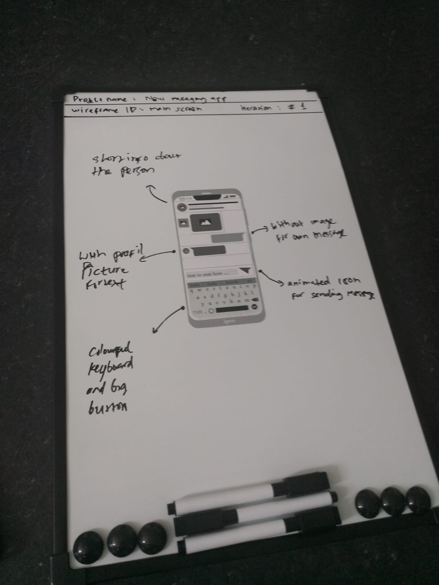

# wireframe
Printable wireframe
 
can be printed on magnetic paper to use for collaboration (See example)
 to edit the wireframe and reuse it for other designs, please open the svg-file with the svg-editor (e.g. inkscape). 
 This work is licensed under a <a rel="license" href="http://creativecommons.org/licenses/by-nc/2.0/">Creative Commons Attribution-NonCommercial 2.0 Generic License</a>.
 

 

 

 

